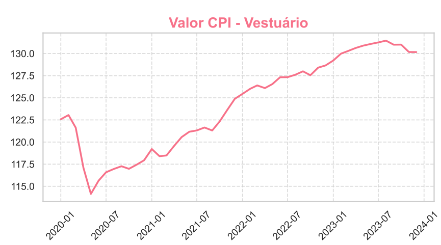

# **Projeto CPI (Consumer Price Index)**  
> Um projeto interativo em Jupyter Notebook para coletar, processar e visualizar dados do Índice de Preços ao Consumidor (CPI) dos EUA.

---

## **📋 Sobre o Projeto**

Este projeto utiliza a API do Bureau of Labor Statistics (BLS) para coletar dados históricos de várias categorias do Índice de Preços ao Consumidor (CPI). Os dados processados são apresentados em gráficos organizados por categoria e salvos em um arquivo PDF consolidado.

O objetivo é fornecer uma análise clara e visual das tendências de preços em diferentes categorias de consumo nos EUA.

---

## **✨ Funcionalidades**

- **Coleta de Dados**: Acessa a API do BLS para obter dados históricos de diferentes séries do CPI.
- **Processamento de Dados**: Filtra e organiza os dados para análise e visualização.
- **Gráficos PDF**: Gera gráficos categorizados em um arquivo PDF consolidado.
- **Código Modular**: Separação do código principal no notebook e funções auxiliares em módulos Python.

---

## **🚀 Instruções de Instalação**

1. **Clone o Repositório**:
   ```
   git clone https://github.com/seu-usuario/projeto-cpi.git
   cd projeto-cpi
   ```

2. **Crie um Ambiente Virtual** (opcional, mas recomendado):
   ```
   python -m venv venv
   source venv/bin/activate  # Para Linux/Mac
   venv\Scripts\activate     # Para Windows
   ```

3. **Instale as Dependências**:
   ```
   pip install -r requirements.txt
   ```

4. **Configure o Arquivo `.env`**:
   - Copie o exemplo de arquivo `.env`:
     ```
     cp .env.example .env
     ```
   - Edite o arquivo `.env` e insira sua chave da API:
     ```
     BLS_API_KEY=insira_sua_chave_aqui
     ```

---

## **🧑‍💻 Como Usar**

1. Abra o **Jupyter Notebook**:
   ```
   jupyter notebook
   ```
2. Execute o notebook **`CPI_Analysis.ipynb`**:
   - **Passo 1**: O notebook conecta-se à API do BLS e coleta os dados das categorias configuradas.
   - **Passo 2**: Os dados são processados e gráficos são gerados.
   - **Passo 3**: Um arquivo PDF chamado `graficos_cpi.pdf` é salvo no diretório principal.

---

## **📂 Estrutura do Projeto**

```
📂 projeto-cpi
├── CPI_Analysis.ipynb          # Notebook principal
├── cpi_utils.py                # Módulo com funções auxiliares
├── requirements.txt            # Lista de dependências do projeto
├── .env.example                # Exemplo de configuração do arquivo .env
├── README.md                   # Documentação
```

---

## **📊 Categorias do CPI Analisadas**

As categorias analisadas neste projeto são:
1. **CPI Geral (Todos os Itens)**  
2. **CPI Núcleo (Excluindo Alimentos e Energia)**  
3. **CPI - Alimentos**  
4. **CPI - Energia**  
5. **CPI - Vestuário**  
6. **CPI - Educação e Comunicação**  
7. **CPI - Outros Bens e Serviços**  
8. **CPI - Cuidados Médicos**  
9. **CPI - Recreação**  
10. **CPI - Transporte**

Os dados são coletados entre os anos **2020 e 2023** (configurável no código).

---

## **📂 Exemplo de Gráficos Gerados**

O arquivo PDF gerado (`graficos_cpi.pdf`) contém gráficos como este:




---

## **📌 Principais Dependências**

- **`pandas`**: Manipulação de dados.
- **`matplotlib`**: Geração de gráficos.
- **`seaborn`**: Estilo aprimorado para gráficos.
- **`requests`**: Conexão com a API do Fe
- **`python-dotenv`**: Gerenciamento de variáveis de ambiente.

---

## **🤝 Contribuições**

Contribuições são bem-vindas! Sinta-se à vontade para abrir uma issue ou enviar um pull request com melhorias ou novas funcionalidades.

---

## **📜 Licença**

Este projeto está licenciado sob a licença MIT. Consulte o arquivo `LICENSE` para mais detalhes.


## Configuração do Arquivo `.env`

Para executar este projeto, você precisa configurar um arquivo `.env` para armazenar a chave da API. Siga os passos abaixo:

1. **Crie um arquivo `.env` no diretório raiz do projeto**:
   - Você pode criar o arquivo manualmente ou copiar o exemplo já fornecido:
     ```bash
     cp .env.example .env
     ```

2. **Adicione sua chave da API ao arquivo `.env`**:
   - Edite o arquivo `.env` com qualquer editor de texto e insira sua chave:
     ```plaintext
     BLS_API_KEY=sua-chave-aqui
     ```

3. **Proteja o Arquivo `.env`**:
   - Certifique-se de que o arquivo `.env` não seja enviado para o repositório adicionando-o ao `.gitignore`.

---

### Exemplo de `.env.example`

Inclua um arquivo chamado `.env.example` no projeto como modelo para o usuário. O conteúdo deve ser algo como:
```plaintext
# Exemplo de configuração do arquivo .env
# Substitua "sua-chave-aqui" pela chave real da API BLS
BLS_API_KEY=sua-chave-aqui
```
